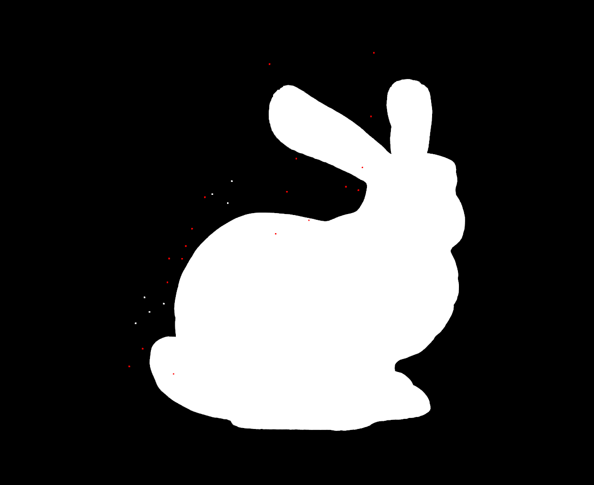
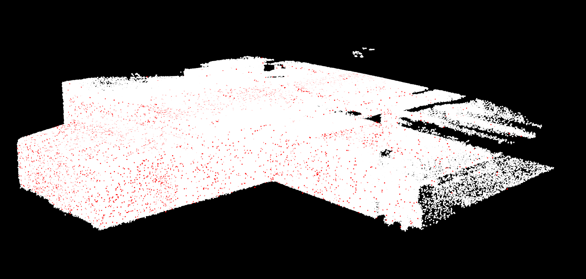

# Roofbolt Detection using LiDARs

# KNN Filter
This algorithm computes the mean and standard deviation of each neighborhood's point. Based on this values and the
computation of the plane that best fits each neighboorhood, points are kept or refused by a comparison with a threshold value.

Tests show that best results:
- Number of neighbors: 8
- Threshold distance: 2 * (stdev of each neighborhood)

In the following image, the bunny point cloud has been corrupted with additive noise. Points colored with red have been
identify as noisy points.

