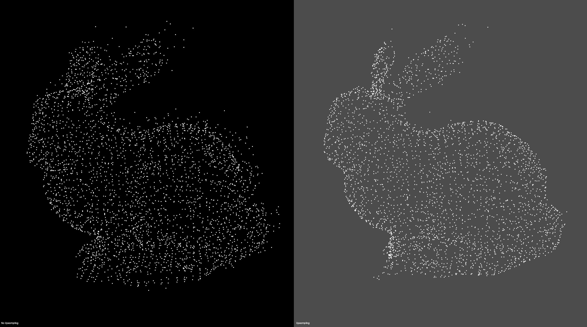

# Roofbolt Detection using LiDARs

# Point Cloud Pre-processing

## 1. KNN Filter
This algorithm computes the mean and standard deviation of each neighborhood's point. Based on this values and the
computation of the plane that best fits each neighboorhood, points are kept or refused by a comparison with a threshold value.

Tests show that best results:
- Number of neighbors: 8
- Threshold distance: 2 * (stdev of each neighborhood)

In the following image, the bunny point cloud has been corrupted with additive noise. Points colored with red have been
identify as noisy points.

## 2. MLS Resampling
Some of the data irregularities (caused by small distance measurement errors) are very hard to remove using statistical analysis.
To create complete models, glossy surfaces as well as occlusions in the data must be accounted for.
In situations where additional scans are impossible to acquire, a solution is to use a resampling algorithm, which attempts to recreate the missing parts of the surface by higher order polynomial interpolations between the surrounding data points. By performing resampling, these small errors can be corrected and the “double walls” artifacts resulted from registering multiple scans together can be smoothed.

In the following image, the bunny point cloud has also been corrupted with additive noise and the MLS upsampling algorithm is used to atenuate this noise and to give the point cloud the bunny shape.
Here, the polynomial order was set to 4 and the search radius to 0.03.

